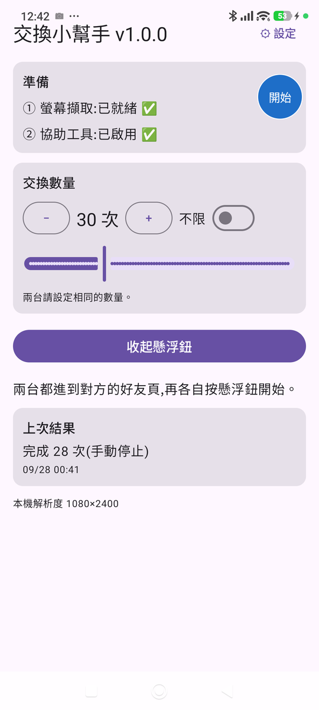

# 交換小幫手(PG AutoTrade)

用兩支 Android 手機,自動完成 Pokémon GO 的**一般現場交換**。兩台各自看自己的畫面、各自點擊,換完設定的數量(或換到沒有可交換的寶可夢)就停下來。

這裡**只放下載用的 APK 與操作說明**,不含原始碼。這是個人小工具,寫給朋友之間使用,不是正式產品,沒有客服。

> 本說明對應版本:**v1.0.2**

**📱 用手機掃描這個 QR code,直接開啟本頁:**

---

## ⚠️ 使用前必看

- **這工具違反 Pokémon GO(Niantic)的服務條款。** 以畫面辨識加系統手勢模擬自動操作交換,屬於官方禁止的自動化行為。
- **風險完全由使用者自己承擔。** 你的帳號、你的決定。不確定就先不要用,或只在小號上試。
- 本工具**不**做 GPS 偽造、不修改官方 APK、不 root、不繞過任何偵測機制:只是截圖辨識畫面,再用 Android 內建的「協助工具」點擊,跟你自己手動點走的是同一條路。
- 本工具與 Niantic、任天堂、The Pokémon Company 無關。

---

## 📌 注意事項(v1.0.2)

1. **特殊交換視窗還不會處理。** 交換時遊戲若跳出特殊訊息視窗(例如 XXL / XXS、極巨化等),目前的 App 還無法處理,這部分會在第二階段加入。遇到時 App 會自動安全停止(懸浮鈕顯示橘色「!」),請手動關掉視窗後再重新開始。
2. **App 每次都只會點列表的第一隻寶可夢。** 開始前請先在遊戲裡設定好篩選,讓要換出去的寶可夢排在最前面。如果不清楚怎麼設定,歡迎跟我反應,我會再想辦法補充說明。
3. **目前只在小米系列手機上測試過。** 其他解析度或其他品牌的手機還沒有驗證。如果在你的手機上用起來有問題,請告訴我**手機型號**,我再想辦法處理。
4. **自動點擊時,點擊的位置會閃一下紅點**(約 0.4 秒),方便確認 App 點了哪裡。確認位置都正確後,可以到 App「設定 → 顯示點擊位置紅點」關閉,交換會稍快一點。
5. **較慢的手機偶爾會稍等一下**:手機忙或發熱時,App 看畫面會變慢,這時會多等一下再動作,不會中途停止(v1.0.2 起)。
6. **Android 11 是 v1.0.2 才開始支援,還沒有實機驗證過。** 安裝時如果被「Play 安全防護」封鎖,可以先到 Play 商店 →「Play 安全防護」→ 齒輪,暫時關閉「使用 Play 安全防護掃描應用程式」,裝好後再打開。用起來有問題請告訴我手機型號。

聯絡方式見下方「[問題回報](#問題回報)」。

---

## 這工具做什麼

- 兩台手機都停在**對方的好友頁**,各自按懸浮鈕「開始」後,自動重複:現場交換 → 選列表**第一隻**寶可夢 → 下一步 → 確定 → 關閉結果畫面。
- 換完你設定的數量(1–99 次,或「不限」)就停下;列表第一格變成空的(可交換的都換完了)也會停下。
- 兩台手機**不需要互相連線**,各自只依自己的畫面判斷;遊戲本身要求雙方都按確定才會成交。
- 隨時可以按懸浮鈕**立刻停止**。

**它不會**:幫你挑選要換哪一隻(永遠是列表第一隻)、關掉遊戲跳出的提示視窗、移動角色位置。

## App 長這樣

首頁由上到下:兩項準備狀態(都要 ✅)、交換數量(+ / − 與滑桿、「不限」開關)、顯示/收起懸浮鈕、上次結果。右上角的藍色圓形「開始」就是懸浮鈕。

---

## 需求

- **兩支** Android **11 以上**的手機,各登入一個 Pokémon GO 帳號,兩個帳號互為好友,人在同一個地點(現場交換)。
- 目前實測過的解析度:寬 1080(例如 1080×2400)。其他解析度還沒驗證,可能會認不出畫面而停止。
- 小米 / Redmi / POCO(HyperOS、MIUI)等手機,第一次設定會多一道「允許受限制的設定」關卡,下面會說明。

---

## 下載與安裝

👉 **[點我下載 PG_AutoTrade-v1.0.2.apk](https://github.com/Jerry2-Yao/PG_AutoTrade-Download/releases/download/v1.0.2/PG_AutoTrade-v1.0.2.apk)**

點上面這個連結就會直接開始下載安裝檔。

> 如果你是自己跑去 [Releases 頁面](https://github.com/Jerry2-Yao/PG_AutoTrade-Download/releases) 找檔案:請點檔名是 `.apk` 的那個,**不要點「Source code (zip)」或「(tar.gz)」**,那兩個是 GitHub 自動附加的壓縮檔,不是安裝檔。

安裝步驟(兩支手機都要裝):

1. 用手機瀏覽器打開上面的連結,下載完成後點開檔案。
2. 瀏覽器可能先跳出「這類檔案可能有害」的警告:因為 APK 不是從 Google Play 下載的,屬於正常現象,點「仍要下載」/「繼續」。
3. 系統擋下並顯示「不允許安裝不明來源」時:點「設定」,打開「允許此來源的應用程式」(來源通常是「Chrome」或「檔案」),回上一頁再點一次 APK。
4. 跳出「Play 保護機制」警告時,選「仍要安裝」/「略過檢查」。
5. 安裝完成,桌面會出現**「交換小幫手」**(藍底、白黃兩色循環箭頭)。

> 如果裝過測試版(名稱是 PG AutoTrade),請**先移除測試版**再安裝,兩者簽章不同,無法直接覆蓋。

---

## 第一次設定(每支手機各做一次)

### 步驟一:開啟「協助工具」權限

App 要靠這個權限幫你點擊。**Android 規定這個開關只能由你手動打開**,App 沒辦法代勞。

一般手機:

1. 打開交換小幫手,按「前往設定開啟協助工具」(或手機「設定 → 協助工具」)。
2. 在已安裝的服務清單找到**「交換小幫手」**,打開開關並同意。
3. 回到 App,首頁的「協助工具」會顯示「已啟用 ✅」。

**小米 / Redmi / POCO(HyperOS 或 MIUI)**:開關是灰的、點下去只跳出「應用程式存取權已遭拒絕」時,請倒過來做:

1. 進入「設定 → 無障礙設定」,往下捲到「下載的應用程式」,點一次灰色的「交換小幫手」,看到「應用程式存取權已遭拒絕」的提示(這一步是為了解鎖下一步的選項,不是失敗)。
2. 到「交換小幫手」的「應用程式資訊」頁,捲到最底部「進階設定」,打開「**允許受限制的設定**」。
3. 回到無障礙設定,現在「交換小幫手」的開關可以打開了。

打開開關時系統會跳出確認視窗。小米類手機標題會寫「危險」,要先勾「我已知曉可能存在的風險…」;按鈕會倒數幾秒才能按,這是防誤按機制,不是當機。

### 步驟二:同意螢幕擷取

在 App 首頁按「授權螢幕擷取」,選**整個螢幕**(Android 14 以上會有「應用範圍」選單;Android 11–13 直接按「立即開始」)。

**這個同意每次重新開啟 App 都要再按一次**,是 Android 的規定,不是 bug。

---

## 每次使用

1. 在 Pokémon GO 先把要換出去的寶可夢設好篩選(例如用標籤),讓**列表第一隻就是要換的**。遊戲會記住上次交換時的篩選。
2. 打開交換小幫手,確認「螢幕擷取」與「協助工具」都是 ✅。
3. 設定**交換數量**:用 + / − 微調,或拖下面的滑桿快速調整;要一直換到沒有為止就打開「不限」。**兩台請設一樣的數量。**
4. 按「顯示懸浮鈕」。懸浮鈕只能放在畫面右側上半部(避開遊戲的按鈕),可以拖曳調整。
5. 兩台都進到**對方的好友頁**,各自按懸浮鈕「開始」。
6. 手不要碰螢幕。懸浮鈕會顯示進度(例如 `2/5`,不限時是 `2/∞`)。

懸浮鈕的顏色:

| 懸浮鈕 | 意思 |
|---|---|
| 藍色「開始」 | 待命,按下開始 |
| 紅色 `2/5` | 執行中,按下立刻停止 |
| 綠色 ✓ | 換完了(達到數量,或寶可夢已換完) |
| 橘色「!」 | 遇到看不懂的畫面,自動安全停止;請手動接手,原因寫在 App 首頁「上次結果」 |

等對方按、等伺服器回應都是正常的,App 會耐心等(最久約 5 分鐘),不會因為對方慢就停止。

---

## 已知限制 / 常見問題

- **只會換列表第一隻**,不會自動選別隻。
- 遇到遊戲的提示視窗(每日交換上限、星沙不足、特殊交換、交換到特殊寶可夢時的額外資訊畫面、XXL/XXS 紀錄等),App 會安全停止,**不會自動關閉視窗**;請手動按掉後再重新開始。
- 「寶可夢已換完」時 App 停在交換畫面,請手動離開交換。
- 兩台設定的數量不同時,先換完的那台會停下,另一台會一直等到逾時才停止。**兩台請設一樣。**
- **不要對這個 App 使用「強制停止」**,會連帶關掉協助工具的授權,下次要重新走步驟一。
- 重開手機或 App 被系統關掉後,協助工具通常還在,但螢幕擷取一定要重新同意。
- 紀錄與截圖在手機上保存 15 天後自動刪除。
- 沒有自動更新,新版本一樣回這個頁面下載安裝(同一個簽章,可以直接覆蓋安裝,設定會保留)。首頁標題會顯示目前版本(例如 `v1.0.2`),回報問題時請附上。

---

## 問題回報

1. 打開交換小幫手 → 右上角「設定」→「**匯出問題回報資料**」。
2. 選 Gmail(或其他方式)寄到:**ynp123ai@gmail.com**
3. 信裡簡單說明發生什麼事、大約幾點。

回報資料包含最近 3 天的紀錄與停止時的截圖(可能看得到訓練家與好友名稱),只會寄給開發者。

---

## 意見回饋與功能許願

用起來覺得哪裡怪、有 bug,或是想許願新功能,歡迎寄信或跟把連結給你的人反應。**不保證會照著意見修改**,採不採用、什麼時候做,由開發者判斷。

下面這幾類請不要許願,專案一開始就刻意排除:

- GPS 偽造 / 搖桿移動位置
- 自動抓寶、自動打道館、自動對戰
- Root、Hook、偽造 Play Integrity 之類繞過官方偵測的東西

---

## 免責聲明

本工具僅供技術研究與朋友之間小範圍交流,不提供任何形式的保固或客服支援。因使用本工具導致的任何帳號問題(包含但不限於警告、停權、封禁),使用者需自行承擔全部後果,與作者無關。請先評估風險再決定是否使用。
