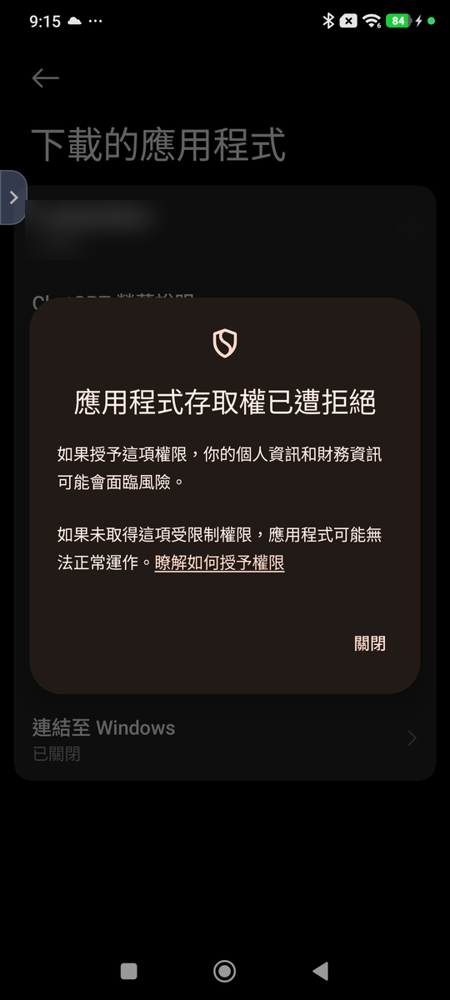
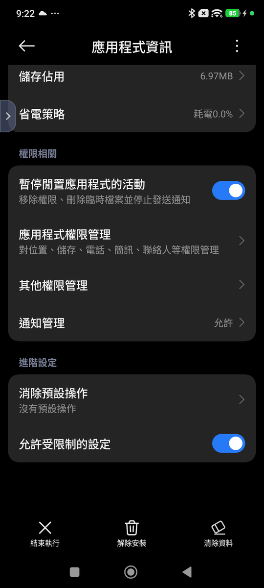

# 交換小幫手(PG AutoTrade)

用兩支 Android 手機,自動完成 Pokémon GO 的**一般現場交換**。兩台各自看自己的畫面、各自點擊,換完設定的數量(或換到沒有可交換的寶可夢)就停下來。

這裡**只放下載用的 APK 與操作說明**,不含原始碼。這是個人小工具,寫給朋友之間使用,不是正式產品,沒有客服。

> 本說明對應版本:**v1.0.7**

**📱 用手機掃描這個 QR code,直接開啟本頁:**

---

## ⚠️ 使用前必看

- **這工具違反 Pokémon GO(Niantic)的服務條款。** 以畫面辨識加系統手勢模擬自動操作交換,屬於官方禁止的自動化行為。
- **風險完全由使用者自己承擔。** 你的帳號、你的決定。不確定就先不要用,或只在小號上試。
- 本工具**不**做 GPS 偽造、不修改官方 APK、不 root、不繞過任何偵測機制:只是截圖辨識畫面,再用 Android 內建的「協助工具」點擊,跟你自己手動點走的是同一條路。
- 本工具與 Niantic、任天堂、The Pokémon Company 無關。

---

## 🆕 更版說明

### v1.0.7(2026-09-28)目前最新

- **遇到「已達到本日交換上限」就自動結束**:懸浮鈕顯示綠色 ✓「已達本日上限」,不會按 OK,也不會再傻等 30 秒後顯示橘色「!」。
- 超級進化寶可夢交換前的「超級等級將被重置」確認視窗,也會自動按 YES(與極巨化相同)。

📜 之前的版本(點我展開)

**v1.0.6**

- **交換後的 XXL / XXS 新紀錄提示會自動關掉了**:換到身高或體重破紀錄的寶可夢時,結果頁下方會跳出藍色的「新紀錄」提示框,現在 App 會自動按下方中央的 **X**,繼續下一次交換(以前會停下來)。
- 實測兩台互換約 **25 秒一次**,100 隻大約 42 分鐘。

**v1.0.5**

- **極巨化 / 超極巨化寶可夢可以自動交換了**:交換前跳出的「確定要交換這隻寶可夢嗎?」視窗,會自動按 **YES**。
- **收起懸浮鈕時,螢幕擷取也會一起停止**:用完不用再去通知列關。
- **待命時長按藍色「開始」3 秒**,就能直接收起懸浮鈕。
- 修正:上面那個確認視窗蓋住畫面時,App 會誤以為還停在「下一步」畫面。

**v1.0.4**

- 「確定」按了遊戲沒反應(一直是綠色)時,約 2 秒後自動再按,最多 5 次;看到橘色「取消」就不再按。
- 較慢的手機畫面晚更新時,不會因為重按被擋下而中途停止。

**v1.0.3**

- 反應變快:畫面出現後約 0.8 秒就點擊,實測每次交換約 25 秒。
- 手機忙或發熱時,交換動畫期間不會再誤判而停止。
- 設定新增「單張畫面確認」(預設關閉)。

**v1.0.2**

- 較慢的手機看畫面變慢時,會多等一下,不會中途停止。
- 開始支援 **Android 11**。
- 問題回報用的紀錄改存到方便讀取的位置。

**v1.0.1**

- 自動點擊時,在點擊位置閃一下紅點,方便確認點到哪裡(可在設定關閉)。

**v1.0.0**

- 第一個正式版:自動現場交換、懸浮鈕、交換數量(1–99 或不限)、問題回報。

---

## ⏱️ 實測交換速度

兩支手機互相交換、數量設「不限」的實測紀錄(2026-09-28):

| 場次 | 手機 | 完成次數 | 花費時間 | 平均每次 | 怎麼結束 | 換 100 隻預估 |
|---|---|---|---|---|---|---|
| 第 1 輪(14:34 開始) | Redmi Note 9 Pro | 31 次 | 13.0 分鐘 | 25.1 秒 | 遇到 XXL 新紀錄提示停下(v1.0.6 起已會自動處理) | 約 42 分鐘 |
| 第 1 輪(14:34 開始) | POCO F5 | 32 次 | 13.4 分鐘 | 25.2 秒 | 手動停止 | 約 42 分鐘 |
| 第 2 輪(15:10 開始) | Redmi Note 9 Pro | 44 次 | 18.4 分鐘 | 25.1 秒 | 已達到本日交換上限 | 約 42 分鐘 |
| 第 2 輪(15:10 開始) | POCO F5 | 44 次 | 18.4 分鐘 | 25.1 秒 | 已達到本日交換上限 | 約 42 分鐘 |

- **每次交換約 25 秒**。假設 100 隻都很順利(中途沒有停下、沒有到達每日上限),**約 42 分鐘可以換完**(平均每次秒數 × 100;實際速度會受網路和手機速度影響)。
- 花費時間是從按「開始」到最後一次交換完成。

---

## 📌 注意事項(v1.0.7)

1. **需要 Android 11 以上。** Android 10 以下的手機(例如 Redmi Note 7)無法安裝,系統會直接拒絕。Android 11 已在小米 9 上實測可用。安裝時如果被「Play 安全防護」封鎖,可以先到 Play 商店 →「Play 安全防護」→ 齒輪,暫時關閉「使用 Play 安全防護掃描應用程式」,裝好後再打開。
2. **會自動處理的特殊畫面**:交換**前**的極巨化 / 超極巨化確認視窗(「確定要交換這隻寶可夢嗎?」)會自動按 **YES**;交換**後**的 XXL / XXS「身高 / 體重新紀錄」提示(下方整塊藍色框)會自動按下方中央的 **X**。遇到「已達到本日交換上限」會直接結束(懸浮鈕顯示綠色 ✓,不會按 OK)。其他沒見過的提示畫面,App 會自動安全停止(懸浮鈕顯示橘色「!」),請手動關掉後再重新開始,並歡迎截圖給我。
3. **App 每次都只會點列表的第一隻寶可夢。** 開始前請先在遊戲裡設定好篩選,讓要換出去的寶可夢排在最前面。如果不清楚怎麼設定,歡迎跟我反應,我會再想辦法補充說明。
4. **目前只在小米系列手機上測試過。** 其他解析度或其他品牌的手機還沒有驗證。如果在你的手機上用起來有問題,請告訴我**手機型號**,我再想辦法處理。
5. **自動點擊時,點擊的位置會閃一下紅點**(約 0.4 秒),方便確認 App 點了哪裡。確認位置都正確後,可以到 App「設定 → 顯示點擊位置紅點」關閉,交換會稍快一點。
6. **每一步大約 1 秒內按下**:畫面出現後約 0.8 秒就會點擊(遊戲畫面剛出現時太早點會沒反應,所以不會更快)。手機忙或發熱時會多等一下,不會中途停止。
7. **「確定」按了沒反應會自動再按**:按下後約 2 秒還是綠色(沒變成橘色「取消」),App 會再按一次,最多 5 次;一旦看到橘色或交換動畫就不會再按(再按會撤回確定)。
8. **設定裡的「單張畫面確認」預設關閉。** 打開後看到一張畫面就判斷目前在哪一步(「確定」仍看兩張),但速度差別不大,一般不需要打開。

聯絡方式見下方「[問題回報](#問題回報)」。

---

## 這工具做什麼

- 兩台手機都停在**對方的好友頁**,各自按懸浮鈕「開始」後,自動重複:現場交換 → 選列表**第一隻**寶可夢 → 下一步 → 確定 → 關閉結果畫面。
- 換完你設定的數量(1–99 次,或「不限」)就停下;列表第一格變成空的(可交換的都換完了)也會停下。
- 兩台手機**不需要互相連線**,各自只依自己的畫面判斷;遊戲本身要求雙方都按確定才會成交。
- 隨時可以按懸浮鈕**立刻停止**。

**它不會**:幫你挑選要換哪一隻(永遠是列表第一隻)、關掉遊戲跳出的提示視窗、移動角色位置。

## App 長這樣

首頁由上到下:兩項準備狀態(都要 ✅)、交換數量(+ / − 與滑桿、「不限」開關)、顯示/收起懸浮鈕、上次結果。右上角的藍色圓形「開始」就是懸浮鈕。

---

## 需求

- **兩支** Android **11 以上**的手機,各登入一個 Pokémon GO 帳號,兩個帳號互為好友,人在同一個地點(現場交換)。Android 10 以下(例如 Redmi Note 7)無法安裝。
- 目前實測過的解析度:寬 1080(例如 1080×2400)。其他解析度還沒驗證,可能會認不出畫面而停止。
- 小米 / Redmi / POCO(HyperOS、MIUI)等手機,第一次設定會多一道「允許受限制的設定」關卡,下面會說明。

---

## 下載與安裝

👉 **[點我下載 PG_AutoTrade-v1.0.7.apk](https://github.com/Jerry2-Yao/PG_AutoTrade-Download/releases/download/v1.0.7/PG_AutoTrade-v1.0.7.apk)**

點上面這個連結就會直接開始下載安裝檔。

> 如果你是自己跑去 [Releases 頁面](https://github.com/Jerry2-Yao/PG_AutoTrade-Download/releases) 找檔案:請點檔名是 `.apk` 的那個,**不要點「Source code (zip)」或「(tar.gz)」**,那兩個是 GitHub 自動附加的壓縮檔,不是安裝檔。

安裝步驟(兩支手機都要裝):

1. 用手機瀏覽器打開上面的連結,下載完成後點開檔案。
2. 瀏覽器可能先跳出「這類檔案可能有害」的警告:因為 APK 不是從 Google Play 下載的,屬於正常現象,點「仍要下載」/「繼續」。
3. 系統擋下並顯示「不允許安裝不明來源」時:點「設定」,打開「允許此來源的應用程式」(來源通常是「Chrome」或「檔案」),回上一頁再點一次 APK。
4. 跳出「Play 保護機制」警告時,選「仍要安裝」/「略過檢查」。
5. 安裝完成,桌面會出現**「交換小幫手」**(藍底、白黃兩色循環箭頭)。

> 如果裝過測試版(名稱是 PG AutoTrade),請**先移除測試版**再安裝,兩者簽章不同,無法直接覆蓋。

---

## 第一次設定(每支手機各做一次)

### 步驟一:開啟「協助工具」權限

App 要靠這個權限幫你點擊。**Android 規定這個開關只能由你手動打開**,App 沒辦法代勞。

1. 打開**交換小幫手**。
2. 按「**前往設定開啟協助工具**」。
3. 在清單中找到「**交換小幫手**」,點進去。
4. 打開開關,依畫面按「允許」/「確定」。
5. 回到交換小幫手。
6. 首頁顯示「**協助工具:已啟用 ✅**」就完成了。

✅ **設定成功就可以直接跳到「步驟二」,不需要看下面的疑難排解。**

#### ⚠️ 為什麼手機會顯示「危險」?

Android 對「**從網路下載的 APK**」又「**要求使用協助工具(無障礙服務)**」的 App,會顯示比較強烈的安全警告。這是正常的保護機制,但它提醒的事情是真的:

- 協助工具是**權限很高**的功能。一般來說,開了它的 App 可以讀取部分畫面資訊,也可以**模擬你的點擊**。
- 交換小幫手的運作方式是:**辨識 Pokémon GO 畫面 → 判斷目前交換進度 → 模擬你的點擊**。其中「模擬點擊」就是靠協助工具;「看畫面」則是靠步驟二的螢幕擷取(每次開啟 App 都要你同意)。

❌ **如果你不信任這個 APK 的來源,請不要開啟這項權限。**

確定信任的話,再依照系統畫面完成授權。

#### 疑難排解:開不起來怎麼辦?

遇到下面任何一種情況,才需要做這一段:

- 「交換小幫手」的開關是**灰色**的,按不動
- 跳出「**應用程式存取權已遭拒絕**」
- 跳出「**為了保障安全,目前無法使用這項設定**」
- 其他原因,就是打不開交換小幫手的協助工具

這是 Android 的「**受限制的設定**」:從網路下載的 App,要先由你手動解除限制,才能開啟協助工具。步驟如下:

1. 先到協助工具清單,點一次「交換小幫手」。
2. 看到「存取權已遭拒絕」之類的訊息,按「關閉」(或「確定」)關掉(**這一步是必要的**,做過之後下一步的選項才會出現)。
3. 進入手機「**設定 → 應用程式 → 交換小幫手**」(也就是「應用程式資訊」頁)。
4. 找到「**允許受限制的設定**」(有些手機叫「**解除受限制的設定**」),點下去並確認。
    - 不同品牌、不同 Android 版本位置不一樣。
    - 有些手機放在右上角的「**⋮**」選單裡。
    - Xiaomi / Redmi / POCO 可能放在頁面最底部的「進階設定」或其他安全相關設定裡。
5. 回到「**設定 → 無障礙 / 協助工具 → 交換小幫手**」。
6. 重新打開開關。

(小米手機的畫面,打開後會像這樣。)

**⚠️ Xiaomi / Redmi / POCO 的提醒**:打開開關時,部分手機會跳出標題寫「危險」的視窗,要先勾選「**我已知曉可能存在的風險……**」,而且確認按鈕會**倒數幾秒**才能按。倒數期間按不下去是正常的,**不是當機**,等倒數結束再按。

**找不到設定?** 每個品牌的名稱不太一樣。可以在手機「設定」最上方的搜尋欄輸入:

- 無障礙
- 協助工具
- 已下載的應用程式

再從結果中找到「交換小幫手」。

#### 怎麼知道已經設定成功?

回到交換小幫手首頁,看到:

**協助工具:已啟用 ✅**

就代表完成了。

❌ 如果首頁還是出現「**前往設定開啟協助工具**」按鈕(沒有 ✅),代表還沒開好,請先把協助工具處理好,**不要繼續下一步**。

### 步驟二:同意螢幕擷取

在 App 首頁按「授權螢幕擷取」,選**整個螢幕**(Android 14 以上會有「應用範圍」選單;Android 11–13 直接按「立即開始」)。

**這個同意每次重新開啟 App 都要再按一次**,是 Android 的規定,不是 bug。

---

## 每次使用

1. 在 Pokémon GO 先把要換出去的寶可夢設好篩選(例如用標籤),讓**列表第一隻就是要換的**。遊戲會記住上次交換時的篩選。
2. 打開交換小幫手,確認「螢幕擷取」與「協助工具」都是 ✅。
3. 設定**交換數量**:用 + / − 微調,或拖下面的滑桿快速調整;要一直換到沒有為止就打開「不限」。**兩台請設一樣的數量。**
4. 按「顯示懸浮鈕」。懸浮鈕只能放在畫面右側上半部(避開遊戲的按鈕),可以拖曳調整。
5. 兩台都進到**對方的好友頁**,各自按懸浮鈕「開始」。
6. 手不要碰螢幕。懸浮鈕會顯示進度(例如 `2/5`,不限時是 `2/∞`)。
7. **用完後**:在首頁按「收起懸浮鈕」,或**長按藍色「開始」3 秒**。懸浮鈕會收起,螢幕擷取也會一起停止(通知列的「螢幕擷取」通知會消失)。下次使用要重新授權螢幕擷取。

懸浮鈕的顏色:

| 懸浮鈕 | 意思 |
|---|---|
| 藍色「開始」 | 待命,按下開始;**長按 3 秒**收起懸浮鈕並停止螢幕擷取 |
| 紅色 `2/5` | 執行中,按下立刻停止 |
| 綠色 ✓ | 換完了(達到數量,或寶可夢已換完) |
| 橘色「!」 | 遇到看不懂的畫面,自動安全停止;請手動接手,原因寫在 App 首頁「上次結果」 |

等對方按、等伺服器回應都是正常的,App 會耐心等(最久約 5 分鐘),不會因為對方慢就停止。

---

## 已知限制 / 常見問題

- **只會換列表第一隻**,不會自動選別隻。
- 遇到遊戲的提示視窗(每日交換上限、星沙不足、特殊交換、交換到特殊寶可夢時的額外資訊畫面、XXL/XXS 紀錄等),App 會安全停止,**不會自動關閉視窗**;請手動按掉後再重新開始。例外是極巨化 / 超極巨化的交換確認視窗(自動按 YES)與 XXL / XXS 新紀錄提示(自動按 X)。
- 「寶可夢已換完」時 App 停在交換畫面,請手動離開交換。
- 兩台設定的數量不同時,先換完的那台會停下,另一台會一直等到逾時才停止。**兩台請設一樣。**
- **不要對這個 App 使用「強制停止」**,會連帶關掉協助工具的授權,下次要重新走步驟一。
- 重開手機或 App 被系統關掉後,協助工具通常還在,但螢幕擷取一定要重新同意。
- 紀錄與截圖在手機上保存 15 天後自動刪除。
- 沒有自動更新,新版本一樣回這個頁面下載安裝(同一個簽章,可以直接覆蓋安裝,設定會保留)。首頁標題會顯示目前版本(例如 `v1.0.7`),回報問題時請附上。

---

## 問題回報

1. 打開交換小幫手 → 右上角「設定」→「**匯出問題回報資料**」。
2. 選 Gmail(或其他方式)寄到:**ynp123ai@gmail.com**
3. 信裡簡單說明發生什麼事、大約幾點。

回報資料包含最近 3 天的紀錄與停止時的截圖(可能看得到訓練家與好友名稱),只會寄給開發者。

---

## 意見回饋與功能許願

用起來覺得哪裡怪、有 bug,或是想許願新功能,歡迎寄信或跟把連結給你的人反應。**不保證會照著意見修改**,採不採用、什麼時候做,由開發者判斷。

下面這幾類請不要許願,專案一開始就刻意排除:

- GPS 偽造 / 搖桿移動位置
- 自動抓寶、自動打道館、自動對戰
- Root、Hook、偽造 Play Integrity 之類繞過官方偵測的東西

---

## 免責聲明

本工具僅供技術研究與朋友之間小範圍交流,不提供任何形式的保固或客服支援。因使用本工具導致的任何帳號問題(包含但不限於警告、停權、封禁),使用者需自行承擔全部後果,與作者無關。請先評估風險再決定是否使用。

---

## 🛠️ 開發技術手冊

想了解這個 App 怎麼運作、用了哪些技術,或之後想自己修改程式,可以看這份手冊:

👉 **[開發技術手冊(docs/Developer_Handbook.md)](docs/Developer_Handbook.md)**

內容包括:整體架構與流程圖、用到的技術與官方文件連結、畫面辨識方法、安全設計、查問題的方法、新增處理畫面的步驟、發布流程與學習路線。一般使用者**不需要**看這份手冊。

