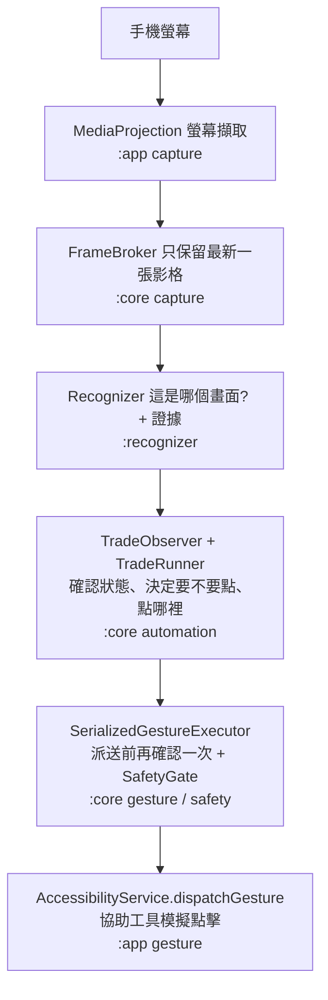
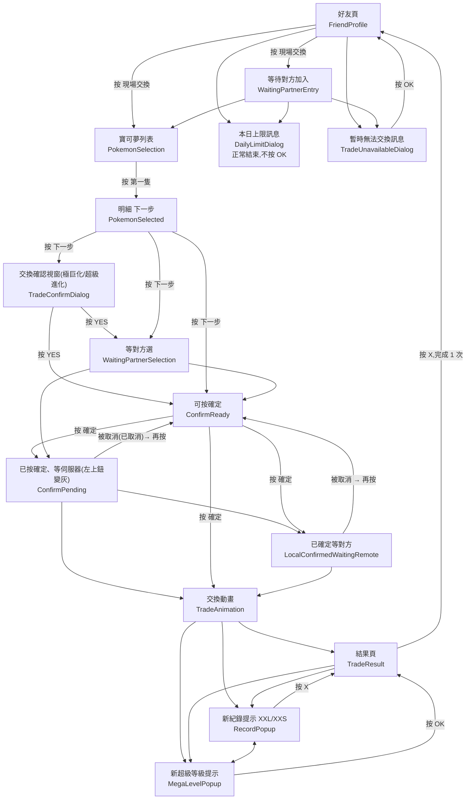

# 交換小幫手 開發技術手冊

> 對象:想看懂、維護、修改這個專案的開發者(包含未來的自己)。
> 版本:依 v1.0.13(2026-10-08)的程式內容撰寫。程式改了,這份手冊也要跟著改。
> 原始碼目前沒有公開;文中提到的檔案路徑(例如 `core/src/...`、`docs/...`)都是指原始碼專案裡的位置。

---

## 0. 這份手冊怎麼用

| 你想做的事 | 先讀 |
|---|---|
| 第一次接觸,想知道整體怎麼運作 | §1 → §4 → §5 |
| 想學相關技術 | §2(技術清單與官方文件)、§16(學習路線) |
| 遊戲出現新畫面,要讓 App 認得並處理 | §6、§7,然後照 §12-A 的步驟做 |
| 要調速度、時限 | §9 |
| App 停下來了,要查原因 | §10 |
| 要出新版 | §13 |

其他文件的角色(本手冊不重複它們的細節,只指路):

| 文件 | 內容 |
|---|---|
| `PG_AutoTrade_Phase1_NormalTrade_Development_Spec.md` | 最初的權威規格(安全原則的來源,§ 編號在程式註解裡常出現) |
| `docs/DEVELOPMENT.md` | 模組邊界、建置、日誌位置的精簡版 |
| `docs/PoGo_Screen_Recognition_Guide.md` | **每個畫面、每顆按鈕的位置與辨識方法**(實測數據) |
| `docs/Production_Device_Findings.md`、`docs/M*_Device_Findings.md` | 各次實機測試的日誌分析與結論(為什麼程式長這樣的證據) |
| `CLAUDE.md` | 使用者的決策紀錄、目前進度與待辦 |

---

## 1. 30 秒看懂系統

**一句話**:每台手機各自不停「截圖 → 辨識目前是哪個畫面 → 決定要不要點 → 用協助工具點下去」,直到換完設定的數量。
兩台手機**不互相通訊**,各自只看自己的畫面;遊戲本身要求雙方都按確定才會成交(規格 §17.0)。



**核心精神:fail-closed(不確定就不動)**。認不出、太舊、模稜兩可、不在預期流程上 → 不點,必要時安全停止,交給人。
「多等一下」的代價是慢;「點錯」的代價可能是交換掉不該換的寶可夢。所有設計都偏向前者。

---

## 2. 技術棧與要學的技術

| 技術 | 在這個專案做什麼 | 學習重點 | 官方文件 |
|---|---|---|---|
| **Kotlin** | 全部程式 | data class、sealed class/interface、`when` 窮舉、object、擴充函式、null 安全 | https://kotlinlang.org/docs/home.html |
| **Kotlin Coroutines** | 自動交換主迴圈(`suspend`、`delay`、`withTimeoutOrNull`) | 結構化並行、取消、逾時 | https://kotlinlang.org/docs/coroutines-overview.html |
| **kotlinx.serialization** | 設定檔 `trade-config.json`、執行結果存偏好設定 | `@Serializable`、JSON 編解碼 | https://kotlinlang.org/docs/serialization.html |
| **Gradle(Kotlin DSL)** | 建置、測試、版本號、簽章 | `settings.gradle.kts` 多模組、`libs.versions.toml` 版本目錄 | https://docs.gradle.org/current/userguide/userguide.html |
| **Android AccessibilityService** | ① 在遊戲上方畫懸浮鈕/紅點(`TYPE_ACCESSIBILITY_OVERLAY`)② 模擬點擊(`dispatchGesture`) | 服務設定 XML、`GestureDescription`、使用者必須手動開啟 | https://developer.android.com/reference/android/accessibilityservice/AccessibilityService 、 https://developer.android.com/reference/android/accessibilityservice/GestureDescription |
| **MediaProjection** | 螢幕擷取 | 每次都要使用者同意、`VirtualDisplay` + `ImageReader` | https://developer.android.com/reference/android/media/projection/MediaProjection 、 https://developer.android.com/reference/android/media/ImageReader |
| **前景服務(Foreground Service)** | 擷取必須跑在 `mediaProjection` 類型的前景服務裡(通知列那個「螢幕擷取」) | Android 14 起的服務類型規定 | https://developer.android.com/develop/background-work/services/fgs |
| **Jetpack Compose** | App 自己的畫面(首頁、設定、開發工具) | `@Composable`、`remember`、`StateFlow.collectAsState` | https://developer.android.com/compose |
| **JUnit 5** | 單元測試、語料測試 | `@Test`、`assumeTrue`(沒有語料就略過) | https://junit.org/junit5/docs/current/user-guide/ |
| **adb** | 安裝 APK、讀日誌、拉截圖 | `install -r`、`pull`、`shell` | https://developer.android.com/tools/adb |
| **App 簽章** | 正式版用固定金鑰簽,才能覆蓋安裝 | keystore、`apksigner verify` | https://developer.android.com/studio/publish/app-signing |
| **影像辨識基礎** | pHash、RGB 顏色距離、結構定位 | 見 §6;pHash 原理可參考 https://www.hackerfactor.com/blog/index.php?/archives/432-Looks-Like-It.html | — |
| **Python + Pillow**(輔助) | 分析日誌、量像素顏色、做語料縮圖(`tools/`) | 讀 JSONL、`Image.getpixel` | https://pillow.readthedocs.io/ |

**不需要會的**:OCR、機器學習、網路程式。本專案刻意不用 OCR(不讀文字),只看版面、顏色、形狀。

---

## 3. 開發環境與常用指令

### 3.1 環境

- Windows + Git Bash(Claude Code 的 Bash 工具就是 Git Bash)。
- **JDK**:系統預設 JDK 25 會讓 AGP 8.13 拋 `IllegalArgumentException: 25.x`,**每次建置前**都要指定 Android Studio 內建的 JDK:
  ```bash
  export JAVA_HOME="/c/Program Files/Android/Android Studio/jbr"
  ```
- Android SDK 在 `C:\Users\<你>\AppData\Local\Android\Sdk`(`build-tools/36.1.0` 裡有 `aapt2`、`apksigner`)。
- 版本組合(`gradle/libs.versions.toml`):Kotlin 2.2.0、AGP 8.13.0、Compose BOM 2025.09.00、JUnit 5.11.4。
  沿用 PG_AutoGift 驗證過的組合,**不要隨便升級**。
- App 設定(`app/build.gradle.kts`):`minSdk 30`(Android 11)、`targetSdk 35`、`compileSdk 36`。

### 3.2 建置與測試

```bash
export JAVA_HOME="/c/Program Files/Android/Android Studio/jbr"

./gradlew test                          # 全部單元測試(core + recognizer + app),不用手機
./gradlew :core:test                    # 只測決策邏輯
./gradlew :recognizer:test -Dpogo.corpus=C:/claude_code/PG_AutoTrade/research_data --rerun-tasks
                                        # 連同實機語料一起測(沒給 -Dpogo.corpus 時語料測試會「略過」)
./gradlew :app:lintRelease              # Android lint(找 API 版本不相容等問題)
./gradlew :app:assembleDebug            # 測試版 APK → app/build/outputs/apk/debug/app-debug.apk(可偵錯,簽章不同)
./gradlew :app:assembleRelease          # 正式版 APK → app/build/outputs/apk/release/app-release.apk(需 keystore)
```

測試結果彙總(看有沒有失敗、跳過):
```bash
grep -h -o 'tests="[0-9]*" skipped="[0-9]*" failures="[0-9]*" errors="[0-9]*"' */build/test-results/test/*.xml
```

### 3.3 手機(adb)

> ⚠️ Git Bash 會把 `/sdcard/...` 自動改寫成 Windows 路徑,檔案會跑到奇怪的地方而且**顯示成功**。
> 帶手機路徑的 adb 指令前**一定**先 `export MSYS_NO_PATHCONV=1`,push 之後用 `adb shell ls -l` 確認。

```bash
export MSYS_NO_PATHCONV=1
adb devices -l                                          # 列出手機;offline 時試 adb reconnect offline
adb -s <序號> install -r app/build/outputs/apk/release/app-release.apk   # 覆蓋安裝(設定保留)
adb -s <序號> shell dumpsys package com.jerry.pgautotrade.app | grep versionName
adb -s <序號> pull /sdcard/Android/data/com.jerry.pgautotrade.app/files/logs/ ./logs
adb -s <序號> pull /sdcard/Android/data/com.jerry.pgautotrade.app/files/diagnostics/ ./diag
adb -s <序號> shell ls -lt /sdcard/DCIM/Screenshots/     # 使用者手動截圖(小米)
```

- **覆蓋安裝會中斷正在跑的交換**,裝之前先問使用者。
- 小米手機:「USB 安裝」沒開時 adb install 會被擋(`INSTALL_FAILED_USER_RESTRICTED`),改成把 APK 放到手機 Download 讓使用者自己點。
- 正式版不可偵錯,`adb shell run-as` 讀不到私有目錄;所以日誌放在外部儲存(§10)。

---

## 4. 專案結構

### 4.1 三個模組

| 模組 | 類型 | 職責 | 不准做的事 |
|---|---|---|---|
| `:core` | 純 Kotlin(JVM) | 狀態、設定、流程決策、安全閘、手勢序列化、日誌格式 | 依賴 Android、`:recognizer`、`:app` |
| `:recognizer` | 純 Kotlin(JVM) | 只回答「這張畫面是什麼」+ 證據、點擊位置計算 | 做流程決策、發手勢、依賴 Android |
| `:app` | Android | 擷取、手勢派送、懸浮窗、UI、檔案 | 把辨識、決策、手勢混在同一個類別 |

**為什麼這樣分**:`core` 與 `recognizer` 不碰 Android,所以可以在電腦上用 JUnit 快速測試(幾秒),
不用每次都裝到手機。`core/src/test/.../ModuleBoundaryTest.kt` 會自動擋下違反邊界的 import。

### 4.2 重要檔案地圖

```
core/src/main/kotlin/com/jerry/pgautotrade/core/
  model/TradeScreenState.kt      ← 所有畫面狀態(新增畫面從這裡開始)
  automation/TradeFlow.kt        ← 合法的畫面轉換表
  automation/TradeRunner.kt      ← 動作(TradeAction)與「何時點、點完怎麼驗證、何時重按」
  automation/TradeObserver.kt    ← 把逐張辨識結果變成「確認的狀態」與「轉換事件」
  automation/TemporalVerifier.kt ← N 張裡要幾張一致才算數(防單張誤判)
  automation/RunSummary.kt       ← 結束結果、首頁與懸浮鈕的文字
  automation/FloatingTapPolicy.kt← 懸浮鈕按一下 / 長按該做什麼
  config/TradeConfig.kt          ← 所有時間、門檻的預設值(§9)
  safety/StopBarrier.kt、SafetyGate.kt ← 停止屏障、派送前的安全閘
  gesture/SerializedGestureExecutor.kt ← 唯一的手勢出口
  capture/FrameBroker.kt         ← 只保留最新一張影格、撮合「給我一張比 X 新的」
  logging/                       ← 稽核日誌(JSONL)、保存期限、問題回報打包

recognizer/src/main/kotlin/com/jerry/pgautotrade/recognizer/
  PhaseOneDetectors.kt           ← 所有偵測器清單(唯一一份)
  PhaseOneRois.kt                ← 所有 ROI、取樣點座標
  Detectors.kt                   ← 檢查類型:PHashCheck、ColorCheck、StateDetector
  Recognizer.kt                  ← 跑全部偵測器、決定結果與信心
  ContentArea.kt                 ← 扣除系統列、錨點座標系
  ButtonRowLocator.kt            ← 好友頁按鈕列結構定位
  DialogYesLocator.kt            ← 白色視窗裡的綠色按鈕定位(YES / OK)
  TapTargets.kt                  ← 每個動作的點擊位置
  OverlaySafeZone.kt             ← 懸浮鈕可以放哪裡

app/src/main/kotlin/com/jerry/pgautotrade/app/
  MainActivity.kt                ← 入口,首頁按鈕的實作
  capture/ScreenCaptureService.kt← MediaProjection 前景服務
  research/ResearchAccessibilityService.kt ← 協助工具服務(懸浮鈕、手勢、研究面板)
  auto/AutoTradeController.kt    ← 自動交換主迴圈(把上面全部串起來)
  auto/FloatingControlOverlay.kt ← 懸浮鈕(待命「開始」按住 3 秒收起:按下輕震 + 旁邊倒數,收起時重震兩下 + 提示)
  auto/TapFlashOverlay.kt        ← 點擊紅點
  gesture/AccessibilityGestureDispatcher.kt ← 真正呼叫 dispatchGesture
  logging/AppAudit.kt            ← 日誌檔位置
  setup/SystemSettingsLauncher.kt← 首頁跳系統設定(協助工具、省電白名單;各步都有退路)
  ui/                            ← Compose 畫面(首頁、設定、開發工具)
  research/ResearchController.kt、ResearchOverlay.kt ← 研究面板(錄製語料用)
```

---

## 5. 執行時架構

### 5.1 Android 元件

| 元件 | 類別 | 誰啟動 | 說明 |
|---|---|---|---|
| Activity | `MainActivity` | 使用者點 App 圖示 | Compose 首頁;按「授權螢幕擷取」→ 系統同意視窗 → 啟動擷取服務 |
| 前景服務 | `ScreenCaptureService` | 使用者同意擷取後 | 持有 MediaProjection;通知列顯示「螢幕擷取」;通知上有「停止擷取」 |
| 協助工具服務 | `ResearchAccessibilityService` | 使用者在系統設定開啟 | 常駐。顯示懸浮鈕、紅點、研究面板;提供 `dispatchGesture` |
| FileProvider | `androidx.core.content.FileProvider` | 匯出問題回報時 | 把 zip 分享給 Gmail 等 |

`CaptureHub` 是同一個程序內共用的「擷取管線」入口:擷取服務建好時登記,停止時註銷;首頁的「螢幕擷取:已就緒 ✅」就是看它。

### 5.2 一輪觀察(tick)做了什麼 —— `AutoTradeController.run()`

1. **取影格**:向 `FrameBroker` 要一張「比上一張新」的影格,最多等 2 秒(`capture.freshFrameTimeoutMs`)。
   等不到 → `CAPTURE_LOST` 停止。**絕不拿舊影格冒充新的**。
2. **辨識**(`handleFrame`):
   - `ContentAreaDetector.detect` 找出扣掉系統列的內容區。
   - `Recognizer.recognize`:跑全部偵測器。**懸浮鈕範圍**與**點擊紅點範圍**傳入 `excluded`,碰到的檢查視為「無法進行」。
   - 寫 `STATE_OBSERVED` 日誌(含辨識耗時、影格年齡)。
3. **決策**:`TradeRunner.offer(evidence, now)` 回傳 `null`(等)/ `Act`(去點)/ `Finished` / `Stopped`。
4. **動作**(`act`):
   - `targetFor` 從**這張影格**算點擊位置,找不到就不點。
   - 寫 `ACTION_PLANNED`;「確定」另外存一張決策截圖(`CONFIRM_DECISION`)。
   - `SerializedGestureExecutor.execute` → **派送前一刻**呼叫 `probe()`:再取一張更新的影格、重新辨識,
     必須仍是預期畫面、信心足夠、目標位置偏移 ≤ 40px(`TARGET_TOLERANCE_PX`)→ 通過 `SafetyGate` 才真的點。
   - 寫 `GESTURE_RESULT`,呼叫 `runner.onDispatched` 記下「待驗證的動作」。
5. **等待下一輪**:間隔 = 處理時間中位數 × 1.5,介於 200 ms 到 1 秒(`AdaptiveCadence`,§9)。

### 5.3 執行緒

- 主迴圈跑在 coroutine(`scope`)裡,一次只處理一張影格(循序,不堆積)。
- 擷取回呼在擷取服務的 Handler 執行緒;懸浮鈕觸控在主執行緒;手勢回呼在 Android 回呼執行緒。
- 跨執行緒共享的狀態都用鎖或原子變數(`StopBarrier` 用 `AtomicReference`、`TapMarkerExclusion` 用 `synchronized`)。

---

## 6. 畫面辨識(`:recognizer`)

### 6.1 座標系:內容區 + 錨點 + 以寬度為單位

- **內容區**(`ContentArea`):扣掉上下「幾乎純黑」的系統列。A 手機(有導覽列)約 `[90, 2270)`,B 手機(無導覽列)`[0, 2400)`。
- **錨點**(`Anchor.TOP / CENTER / BOTTOM`):PoGo 的元素貼齊上緣、中線或下緣。例如「下一步」貼齊下緣,
  所以在有導覽列的手機上會整個往上移,但「距離下緣」不變。
- **以寬度為單位**:y 位移用「內容寬度」當單位,因為 PoGo 元素的像素大小跟著寬度走。
- 所有座標在 `PhaseOneRois.kt` 裡以「A 手機實測像素」寫出,再由 `AnchoredRoi.fromPixels` 換算。

### 6.2 三種檢查

| 檢查 | 類別 | 原理 | 適合 | 注意 |
|---|---|---|---|---|
| 形狀 | `PHashCheck` | 感知雜湊:灰階 → 縮 32×32 → DCT → 取低頻 8×8 → 63 bit;比漢明距離 | 固定位置、固定樣子的圖示/按鈕 | **不管亮度**:變暗的按鈕形狀不變(極巨化視窗的教訓) |
| 顏色 | `ColorCheck` | 取樣點附近平均 RGB,與預期顏色的歐氏距離 | 只差顏色的狀態(綠色確定 vs 橘色取消)、有沒有變暗 | 不要轉灰階;門檻取「同狀態最大距離」與「其他畫面最小距離」之間 |
| 結構定位 | `FriendActionRowCheck`、`DialogYesCheck`、`DialogPanelCheck` | 用規則在影像裡**找**元素(例如找一排間距均勻的綠字、找白色視窗裡的綠色膠囊) | 位置會變的元素(好友頁按鈕列、視窗高度隨文字改變) | 找的時候從元素內部往外找,別從螢幕邊緣找(背景可能同色) |

「取反向」:`AbsentPHashCheck` = 這塊**不可以**像某個參考(用來區分長得很像的兩個畫面)。

### 6.3 偵測器與辨識結果

- `StateDetector` = 一個狀態 + 多項檢查,**全部通過**才算符合;分數取**最弱**那一項(一個強訊號不能替另一個勉強的背書)。
- `Recognizer` 的決策順序(fail-closed):
  1. 沒有候選符合 → `Unknown`
  2. 兩個以上符合 → `Unknown / AMBIGUOUS`
  3. 恰好一個 → 依「對門檻的餘裕」與「對第二名的差距」分級 HIGH / ACCEPTABLE / LOW(`ConfidencePolicy`);LOW → `LowConfidence`
- 每筆結果都是 `RecognitionEvidence`:狀態、信心、每項檢查的距離與分數、偵測器版本(`V`,改偵測器就要遞增)。

### 6.4 目前的偵測器(`PhaseOneDetectors.kt`)

| 狀態 | 主要檢查 |
|---|---|
| FriendProfile(好友頁) | 綠字按鈕列 3~4 顆(結構)+ 不是結果頁 |
| WaitingPartnerEntry(等待對方加入) | 交換畫面左上圖示 + 提示列 pHash |
| PokemonSelection(寶可夢列表) | 返回箭頭 + 放大鏡 pHash |
| PokemonSelected(明細,下一步) | 下一步 pHash + **下一步是亮綠**(沒被視窗蓋住) |
| TradeConfirmDialog(極巨化/超級進化確認視窗) | 背後下一步**變暗** + 白色視窗裡找得到綠色 YES |
| WaitingPartnerSelection(等對方選) | 交換圖示 + 沒有確定鈕 + 自己的面板 |
| ConfirmReady(可按確定) | 交換圖示 + 確定鈕綠色 + 畫面沒變暗 + **左上鈕是亮的** |
| ConfirmPending(已按確定、等伺服器) | 交換圖示 + 確定鈕綠色 + 畫面沒變暗 + **左上鈕變灰** |
| LocalConfirmedWaitingRemote(已確定等對方) | 交換圖示 + 取消鈕橘色 + 沒變暗 |
| TradeAnimation(交換動畫) | 兩個角落是深藍 |
| TradeResult(結果頁) | 選單鈕 + 關閉鈕 pHash + 不是列表 |
| RecordPopup(XXL/XXS 新紀錄) | 下方兩點青藍 + X 鈕淺色圓面 |
| MegaLevelPopup(新超級等級登場) | 下方深青遮罩兩點 + OK 綠色漸層左右兩段 |
| DailyLimitDialog(本日上限) | 漸層背景兩點 + 白色視窗高約 0.53×寬 + 綠色按鈕 + 上限文字 pHash |
| TradeUnavailableDialog(暫時無法交換) | 同上版面 + 「暫時無法使用交換功能」文字 pHash |
| PartnerLeftDialog(朋友退出) | 同上背景 + 白框高約 0.60×寬 + 「朋友退出本次交換」文字 pHash |

各畫面的實測座標、顏色、門檻理由,全部在 `docs/PoGo_Screen_Recognition_Guide.md`。

---

## 7. 流程決策(`:core automation`)

### 7.1 合法的畫面轉換(`TradeFlow`)



「等待對方加入」「等對方選」「已確定等對方」可能停留太短而看不到(對方比較快、或畫面一閃而過)。

不在表上的轉換 → `UNEXPECTED_TRANSITION` 安全停止。

### 7.2 狀態怎麼被「確認」:`TemporalVerifier` + `TradeObserver`

- 預設 **2-of-3**:最近 3 張裡至少 2 張一致才確認(`temporal.requiredAgreeingFrames / windowFrames`)。
  設定開啟「單張畫面確認」時,一般畫面改為 1 張,但「確定」仍要 2 張 HIGH。
- 影格序號必須**嚴格遞增**(不可重用舊影格)。
- **兩種新鮮度**:
  - 追蹤畫面走到哪:影格可以舊到 10 秒(`maxTrackingEvidenceAgeMs`)。
  - 據以**點擊**:最新那張必須在 2 秒內(`maxEvidenceAgeMs`)。
  (慢手機實機的教訓:交換動畫時辨識一張要 2 秒,全部不採用會漏看中間畫面,見 `Production_Device_Findings.md`)
- 連續 30 秒沒有任何可信辨識 → `UNKNOWN_SCREEN` 停止(`observation.unknownTimeoutMs`)。

### 7.3 動作(`TradeAction`,在 `TradeRunner.kt` 開頭)

| 動作 | 從哪個畫面 | 點擊位置 | 預期轉到 | 備註 |
|---|---|---|---|---|
| TAP_LOCAL_TRADE | 好友頁 | 按鈕列第 2 顆(結構定位) | 等待對方加入 / 列表 / 本日上限 / 暫時無法交換 | |
| TAP_FIRST_POKEMON | 列表 | 左上第一格 | 明細 | 第一格空白連續 2 次 → 結束「寶可夢已換完」 |
| TAP_NEXT | 明細 | 下一步中心 | 確認視窗 / 等對方選 / 確定 | |
| TAP_DIALOG_YES | 確認視窗 | 找到的綠色 YES 中心 | 等對方選 / 確定 | |
| TAP_UNAVAILABLE_OK | 暫時無法交換訊息(交換中任何一步) | 找到的綠色 OK 中心(與 YES 同一種找法) | 好友頁 | 等效果中的動作作廢,不算非預期 |
| TAP_PARTNER_LEFT_OK | 朋友退出訊息(交換中任何一步) | 找到的綠色 OK 中心 | 好友頁 | 等效果中的動作作廢,不算非預期 |
| TAP_CONFIRM | 可按確定 | 確定鈕(中線錨點) | 等伺服器(左上變灰)/ 已確定等對方 / 動畫 | **唯一不可逆**:只收 HIGH、另一個只收 HIGH 的驗證器也要同意 |
| TAP_CLOSE_RECORD | 新紀錄提示 | 下方中央 X(與結果頁 X 同位置) | 結果頁 / 好友頁 / 新超級等級提示 | |
| TAP_MEGA_LEVEL_OK | 新超級等級提示 | 綠色 OK 中心(比結果頁 X 高約 77px) | 結果頁 / 好友頁 / 新紀錄提示 | |
| TAP_CLOSE_RESULT | 結果頁 | 下方中央 X | 好友頁 / 新紀錄提示 / 新超級等級提示 | |

### 7.4 點擊規則(`TradeRunner.offer`)

1. 只在**確認過的狀態**上動作,而且**最新那張**也必須是這個狀態、信心夠。
2. **穩定時間**:從第一次看到這個畫面起至少 0.8 秒才點(`minimumSettleMs`;太早點 PoGo 會沒反應,實測 0.6 秒不行)。
3. 同時只有一個「待驗證的動作」(`pending`)。點完之後,要看到**比點擊更新的影格**轉到預期狀態,才算有效。
4. 30 秒內沒轉到預期狀態 → `TRANSITION_TIMEOUT` 停止(`automation.actionEffectDeadlineMs`)。
5. **重按**(只有兩種,其他動作一律不重試):
   - 確定:按完 2 秒仍是 HIGH 綠色確定(**左上鈕是亮的**)、且期間**從沒看過**左上變灰/橘色取消/動畫/結果頁 → 重按,最多 5 次。
     重按前一刻安全閘發現畫面已變 → 視為前一次已生效,不停止。(重按橘色取消會**撤回確定**,所以規則很嚴)
     v1.0.10:伺服器慢時遊戲已收到確定、按鈕還綠著但左上變灰;舊版在這時重按,可能落地時剛好變橘色 → 撤回確定(2026-10-02 實機;之後發現遊戲也會自己取消確定,原因未完全確定)。
   - 確定被遊戲取消(變灰或橘色之後回到亮的綠色確定,畫面有「已取消」):當成新的確定畫面,照第一次的條件再按,一次交換最多 3 次(v1.0.11)。
   - 交換後的提示(新紀錄、新超級等級):按完 2 秒仍是同一種提示 → 再按,兩種合計一次交換最多 3 次。
6. 完成 `maxTrades` 次(回到好友頁)→ `Finished(REACHED_TARGET)`。

### 7.5 結束方式

| 結果 | 懸浮鈕 | 原因 |
|---|---|---|
| `FINISHED_TARGET` | 綠 ✓ | 達到設定數量 |
| `FINISHED_NO_MORE_POKEMON` | 綠 ✓ | 列表第一格空白 |
| `FINISHED_DAILY_LIMIT` | 綠 ✓ | 本日交換上限訊息 |
| `USER_STOPPED` | 藍「開始」 | 使用者按懸浮鈕停止 |
| `SAFETY_STOPPED` | 橘「!」 | 任何安全停止(`StopReason`,首頁「上次結果」有中文原因;有截圖時另有「查看停止時的畫面」) |

安全停止時 `AutoTradeController.stop()` 把診斷截圖檔名存進 `RunSummary.screenshotFile`;首頁用 `stopScreenshot()`(只有 `SAFETY_STOPPED` 才回傳)
找 `diagnostics/` 裡的 png,檔案還在才顯示按鈕(15 天保存期限過了就不顯示)。懸浮鈕旁的短說明會多一行「回 App 看畫面」。
目的:讓使用者自己看出是手機的問題(例如 MIUI 高溫提醒蓋住遊戲 → `UNKNOWN_SCREEN`),不必靠開發者讀日誌。

---

## 8. 安全設計

| 機制 | 位置 | 保證 |
|---|---|---|
| 停止屏障 | `StopBarrier` | 一旦要求停止,所有舊「通行證」立即作廢,之後不會再有任何點擊;停止是黏著的,只有人工重新開始才發新通行證 |
| 唯一手勢出口 | `SerializedGestureExecutor` | 同時最多一個手勢、不排隊、不重試;派送前後都檢查通行證;等回呼有上限 |
| 派送前再確認 | `AutoTradeController.probe` | 用**更新的一張影格**重新辨識,畫面或位置不對就不點 |
| 安全閘 | `SafetyGate` | 本 App 不在前景、螢幕亮著且解鎖、方向與幾何沒變、授權影格夠新、畫面是預期狀態、工作階段有效、沒被要求停止 → **全部**成立才放行,並列出所有不成立的原因 |
| 幾何版本 | `FrameSequencer` | 螢幕尺寸或方向一變,舊證據與舊座標全部作廢 |
| 懸浮窗排除 | `excluded` 參數、`OverlaySafeZone` | 懸浮鈕和紅點不會被當成遊戲畫面;懸浮鈕只能放在不擋任何偵測區與點擊位置的地方 |
| 設定檔驗證 | `TradeConfigValidator` | 設定檔數值不合理 → 拒絕(不偷偷退回預設值) |

**前景判斷不查套件名**(使用者決定、規格 §22.1):「PoGo 在前景」= 本 App 不在前景 + 螢幕亮/解鎖 + 新鮮截圖辨識為預期的 PoGo 畫面。
所以不需要額外權限。

**重要**:新增任何「會點擊」的功能時,都必須走 `TradeRunner` 產生 `Act` → `SerializedGestureExecutor`,
不可以在其他地方直接呼叫 `dispatchGesture`(`ModuleBoundaryTest` 會檢查 `dispatchGesture` 只出現在 `AccessibilityGestureDispatcher.kt`,
`:core`、`:recognizer` 完全不能碰)。

---

## 9. 設定值(`TradeConfig.kt` 預設)

| 設定 | 預設 | 意義與依據 |
|---|---|---|
| `polling.minPollIntervalMs` / `maxPollIntervalMs` | 200 / 1000 ms | 看畫面的間隔上下限 |
| `polling.safetyFactor` | 1.5 | 間隔 = 處理時間**中位數** × 1.5(用 p95 會被偶發慢樣本拖到 3 秒以上) |
| `capture.freshFrameTimeoutMs` | 2000 | 等一張新影格的上限 |
| `temporal.requiredAgreeingFrames` / `windowFrames` | 2 / 3 | 2-of-3 確認 |
| `temporal.maxEvidenceAgeMs` | 2000 | 據以點擊的影格新鮮度 |
| `temporal.maxTrackingEvidenceAgeMs` | 10000 | 追蹤畫面的影格新鮮度 |
| `observation.unknownTimeoutMs` | 30000 | 連續認不出多久才停(容許網路延遲,使用者要求) |
| `automation.actionEffectDeadlineMs` | 30000 | 點完多久沒反應就停 |
| `automation.confirmRetryAfterMs` / `maxConfirmRetries` | 2000 / 5 | 確定重按(使用者決定 2 秒) |
| `transitions[狀態].minimumSettleMs` | 需點擊的畫面 800 | 穩定時間 |
| `transitions[狀態].maximumDeadlineMs` | 60 s;等待對方的畫面 300 s | 停留上限(交給 PoGo 自己的逾時) |
| `recognition.highMargin` 等 | 0.4 / 0.15 … | 信心分級門檻 |
| `gesture.tapDurationMs` / `callbackTimeoutMs` | 50 / 3000 ms | 點擊按住時間、等回呼上限 |

- 可以用 App 私有目錄的 `trade-config.json` 覆寫(`ConfigRepository`),但一般使用者不會用到。
- **改預設值要有實機數據當依據**,並寫進 `Production_Device_Findings.md`。

---

## 10. 日誌、診斷與除錯

### 10.1 檔案位置(App 專屬外部儲存,接電腦就能 adb pull)

```
/sdcard/Android/data/com.jerry.pgautotrade.app/files/
  logs/audit-YYYYMMDD.jsonl      ← 稽核日誌,一行一個 JSON 事件,只附加
  diagnostics/<工作階段>_<角色>_F<影格>_<原因>.png/.json
                                 ← 安全停止當下的截圖+辨識證據;每次按「確定」的決策截圖(CONFIRM_DECISION)
  research/                      ← 研究面板錄製的語料
```
保存 15 天後自動刪除(`Retention`)。使用者也可以用「設定 → 匯出問題回報資料」打包成 zip。

### 10.2 主要事件

| 事件 | 重要欄位 |
|---|---|
| `RESEARCH_SESSION_STARTED` / `STOPPED` | `sessionId`(`AUTO_日期_時間`)、設定(maxTrades、singleFrame) |
| `STATE_OBSERVED` | `localState`(這張辨識成什麼)、`sessionState`(目前確認的狀態)、`recognitionConfidence`、`frameAgeMs`、`performance.recognitionMs`;訊息「影格太舊,跳過」 |
| `STATE_TRANSITION` | `previousState` → `nextState`、`dwellMs`、`trades=` |
| `ACTION_PLANNED` | `action`、`tap=(x,y)`、`attempt=`(第幾次按) |
| `GESTURE_RESULT` | `Completed` / `SafetyDenied(...)` / `Timeout` … |
| `SAFETY_STOP` | `safetyStopReason`、`message`(中文細節) |
| `SESSION_COMPLETE` | 正常結束 |

時間:`wallTimeMs`(牆上時間,換算台灣時間 +8)、`elapsedRealtimeMs`(開機後單調時間,算間隔用這個)。

### 10.3 查問題的步驟

1. `adb pull` 日誌與 diagnostics。
2. 找最後一個 `SAFETY_STOP`,看原因;打開同名的 PNG 看當下畫面,JSON 看每項檢查的距離/門檻(哪一項沒過)。
3. 往前看 `STATE_OBSERVED` 的狀態序列、`frameAgeMs`、`recognitionMs`,判斷是「認錯」「認不出」「太慢」還是「點了沒反應」。
4. 用 Python 做統計(例:每次交換的時間 = 相鄰兩個「結果頁 → 好友頁」轉換的間隔)。

```python
import json
ev = [json.loads(l) for l in open("audit-20260928.jsonl", encoding="utf-8")]
stops = [e for e in ev if e["eventType"] == "SAFETY_STOP"]
done = [e for e in ev if e["eventType"] == "STATE_TRANSITION" and e.get("nextState") == "FriendProfile"]
```

常見停止原因對照:

| 原因 | 通常代表 |
|---|---|
| `UNKNOWN_SCREEN` | 出現沒見過的畫面(新提示視窗)→ 收樣本、新增偵測器(§12-A) |
| `TRANSITION_TIMEOUT` | 點了沒反應 30 秒,或畫面被誤認成原本的畫面 |
| `UNEXPECTED_TRANSITION` | 看到不在流程表上的轉換(漏看中間畫面、使用者手動操作) |
| `CAPTURE_LOST` | 擷取中斷,或一直拿不到夠新的畫面 |
| `SAFETY_DENIED` | 派送前安全閘不放行(畫面變了、App 跑到前景…) |

---

## 11. 測試

### 11.1 測試種類

| 種類 | 位置 | 需要什麼 | 例子 |
|---|---|---|---|
| 決策邏輯單元測試 | `core/src/test` | 無 | `TradeRunnerTest` 用 `Sim` 模擬一台手機每 200ms 一張影格 |
| 辨識單元測試(合成影像) | `recognizer/src/test` | 無 | `DialogYesLocatorTest` 用程式畫出假畫面 |
| 語料測試(實機截圖) | `recognizer/src/test` | `-Dpogo.corpus=…/research_data` | `PhaseOneCorpusTest`:371 張已標註影格**誤判必須為 0** |
| 樣本測試 | `TradeConfirmDialogSampleTest` | 同上 | 特殊畫面的實機截圖要辨識正確、點擊位置落在按鈕上 |
| 回放測試 | `ObserverReplayTest` | 同上 | 把一整段錄製的影格依序餵給觀察器,要重建出正確的交換次數 |
| 模組邊界 | `ModuleBoundaryTest` | 無 | 擋下違規 import |

目前共 220 個測試(core 176、recognizer 44)。

### 11.2 開發方式:先寫會失敗的測試(TDD)

本專案每個修正都照這個順序做:
1. 用實機日誌找出問題 → 寫一個**重現問題**的測試 → 跑一次,**確認它失敗**、而且失敗原因是對的。
2. 改最少的程式讓它通過。
3. 跑**全部**測試 + 語料測試,確認沒有把其他東西弄壞(語料誤判仍為 0)。

### 11.3 語料(`research_data/`,不進版控)

```
research_data/
  raw/phoneA|phoneB/files/research/TRADE_000002/device_X/frame_000123.png  ← M4 錄製的一般交換
  labels/phoneA.json、phoneB.json                                          ← 人工標註 {影格序號: 狀態}
  dialogs/                                                                 ← 特殊畫面樣本(見該資料夾 README.txt)
  corpus_report.txt                                                        ← 語料測試的混淆矩陣輸出
```
工具:`tools/contact_sheet.py`(縮圖總覽,方便標註)、`tools/m4_labels.py`(標註產生)、
`FingerprintGeneratorTest`(從參考影格算 pHash 指紋)、`CorpusScanTest`(掃描分析)。

---

## 12. 常見修改的做法(食譜)

### A. 遊戲出現新畫面,要讓 App 認得並處理

這是最常見的修改。極巨化視窗、新紀錄提示、本日上限、新超級等級提示都是照這個流程做的。

1. **收樣本**:
   - 自動交換時遇到先不要碰,等 30 秒 App 停下 → `diagnostics/` 會有截圖。
   - 請使用者手動截圖「這個畫面」和「按掉之後的下一個畫面」,並說明要按哪裡。遊戲行為以使用者說的為準,**不要猜**。
   - 樣本放進 `research_data/dialogs/`,更新該資料夾的 `README.txt`。
   - 最好兩台都有(A 有導覽列、B 沒有)。
2. **量特徵**(Python + Pillow 或暫時的 JUnit 測試):
   - 找「這個畫面有、其他畫面都沒有」的特徵:某處的顏色、某個按鈕的形狀、某種結構。
   - 同時量**語料裡所有畫面**在同一位置的值,確認有足夠的距離(門檻取在中間)。
3. **核心(`:core`)**,先寫失敗的測試:
   - `TradeScreenState.kt`:新增狀態(`data object`,手寫穩定 id),加進 `ALL`。
   - `TradeFlow.kt`:加入合法轉換。
   - `TradeRunner.kt`:需要點擊就新增 `TradeAction`(從哪、預期轉到哪、是否不可逆);相關動作的 `expected` 也要加入新狀態。
   - `TradeConfig.kt`:`DEFAULT_TRANSITIONS` 加上穩定時間與停留上限(`TradeConfigTest` 會檢查每個狀態都有)。
   - `RunSummary.kt`:狀態的中文名稱。
4. **辨識(`:recognizer`)**,先寫失敗的樣本測試:
   - `PhaseOneRois.kt`:新增取樣點 / ROI(以 A 手機像素寫,註明實測值)。
   - `PhaseOneDetectors.kt`:新增 `StateDetector`,加進 `STATE_DETECTORS`,**遞增版本字串 `V`**。
   - 需要找位置就在 `TapTargets.kt` 加方法(找不到回 null)。
5. **App**:`AutoTradeController.targetFor` 加上新動作的點擊位置。
6. **驗證**:全部測試 + 語料(誤判 0)+ 樣本辨識為 HIGH、點擊位置在按鈕上。
7. **記錄**:`PoGo_Screen_Recognition_Guide.md` 新增一節(位置、顏色、門檻理由)、`Production_Device_Findings.md` 記實機經過。

### B. 調整速度或時限

- 改 `TradeConfig.kt` 的預設值,並在測試中用明確的值驗證行為。
- 先看日誌數據再改(例如穩定時間 0.8 秒是因為實測 0.6 秒會按了沒反應)。

### C. 支援不同解析度

- 目前只驗證寬 1080。錨點與「以寬度為單位」理論上能等比換算,但 pHash、顏色取樣點都是用 1080 寬的截圖量的。
- 做法:收該解析度的語料 → 跑語料測試看哪些偵測器失效 → 必要時補第二組指紋(`PHashCheck` 可以有多個參考)。

### D. 新增設定開關

照「顯示點擊位置紅點」「單張畫面確認」的做法:
`AppPrefs.kt` 讀寫 → `SettingsScreen.kt` 加 Switch 與說明 → `AutoTradeController.toggle` 開始時讀取並放進 `runConfig`。

### E. 支援更低的 Android 版本

- 暫時把 `minSdk` 改低跑 `./gradlew :app:lintRelease`,看 `NewApi` 錯誤。
- 2026-09-28 試過 Android 10:34 處用到 Android 11 才有的 API(螢幕大小、懸浮窗版面),使用者決定不支援。

---

## 13. 建置、簽章與發布

1. `app/build.gradle.kts`:`versionCode` +1、`versionName` 改新版號。
2. `./gradlew test`(+語料)、`:app:lintRelease`、`:app:assembleRelease`。
3. 確認:
   ```bash
   B="$LOCALAPPDATA/Android/Sdk/build-tools/36.1.0"      # Android SDK 的 build-tools(依實際安裝位置)
   $B/aapt2.exe dump badging app/build/outputs/apk/release/app-release.apk | grep -E "^package|minSdk"
   $B/apksigner.bat verify --print-certs app/build/outputs/apk/release/app-release.apk   # 憑證要與舊版相同
   ```
4. **簽章**:`release.jks` + `keystore.properties`(在專案根目錄,**不進版控**)。
   **遺失就再也無法發布可以覆蓋安裝的更新**,務必另外備份。
5. **發布到下載頁**(公開 repo `Jerry2-Yao/PG_AutoTrade-Download`,本機 `C:\claude_code\PG_AutoTrade-Download`):
   - README:版本字串、注意事項標題、下載連結、首頁版本範例;「🆕 更版說明」最上面加新版本,上一版移進摺疊區。
   - `gh release create v<版本> PG_AutoTrade-v<版本>.apk --title ... --notes ...`
   - 確認下載連結回 200。
6. **發布要使用者同意**(除非使用者事先說直接發布)。原始碼 repo **不推 GitHub**(使用者決定)。

---

## 14. Git 工作方式

- 只做本地版控。每個功能開一個分支(例如 `record-popup`),完成並實測後 `--ff-only` 合併回 `main`、刪除分支。
- commit 訊息用繁體中文寫清楚做了什麼、為什麼(含實機數據)。
- `research_data/`、APK、簽章檔不進版控(`.gitignore`)。

---

## 15. 已知限制與未來方向

| 項目 | 現況 |
|---|---|
| 解析度 | 只驗證寬 1080 |
| Android 版本 | 11 以上;10 不支援 |
| 不讀文字 | 只比對文字區的形狀(pHash),不辨識字;同版面的新訊息會認不出 → 30 秒後停止 |
| 未處理的畫面 | 交換後的其他提示(第二階段)、星沙不足、特殊交換等 → 會安全停止 |
| 雙機通訊 | 第一階段刻意不做;兩台各自判斷 |
| 只換第一隻 | 使用者用遊戲內篩選決定要換的寶可夢 |
| 延後的小問題 | `docs/DEVELOPMENT.md` 最後一節(M2、M6–M11) |

---

## 16. 學習路線建議

| 階段 | 目標 | 做法 |
|---|---|---|
| 1 | 會讀 Kotlin | Kotlin 官方 Basic syntax、Classes、Null safety、Sealed classes;讀 `TradeScreenState.kt`、`TradeFlow.kt` |
| 2 | 看懂決策邏輯 | 讀 `TradeRunnerTest.kt`(每個測試就是一個情境),對照 `TradeRunner.kt`;自己改一個測試看它失敗 |
| 3 | 看懂辨識 | 讀 `Detectors.kt`、`PhaseOneDetectors.kt`;用 Python 在 `research_data` 截圖上量一個顏色,和程式裡的值對照 |
| 4 | 會建置、會用 adb | §3 的指令;裝到手機、pull 一次日誌、用 §10 的 Python 片段算出交換次數 |
| 5 | 看懂 Android 部分 | AccessibilityService、MediaProjection、前景服務的官方文件;讀 `ScreenCaptureService.kt`、`AutoTradeController.kt` |
| 6 | 自己做一次修改 | 照 §12-A 新增一個畫面(可以先用已有的樣本當練習) |

---

## 17. 名詞對照

| 名詞 | 意思 |
|---|---|
| 影格(frame) | 螢幕擷取得到的一張截圖,有嚴格遞增的序號 |
| 內容區 | 扣掉狀態列與導覽列之後,PoGo 實際畫的區域 |
| ROI | Region of Interest,要檢查的一塊區域 |
| 錨點 | 座標以上緣、中線或下緣為基準 |
| pHash | 感知雜湊,比較圖案形狀是否相似(不看亮度) |
| 偵測器 | 一個畫面狀態的一組檢查 |
| 證據(evidence) | 一張影格的辨識結果與全部檢查數據 |
| N-of-M | 最近 M 張裡至少 N 張一致才確認 |
| 穩定時間(settle) | 畫面出現後要等多久才點 |
| pending | 已經點了、還在等效果出現的動作 |
| 安全停止 | App 自己判斷不安全而停下(橘色「!」) |
| 語料(corpus) | 實機錄下並人工標註的截圖集合,用來驗證辨識 |
| fail-closed | 不確定時選擇不動作 |
